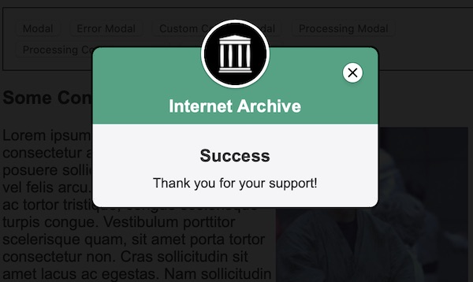

 [](https://codecov.io/gh/internetarchive/iaux-modal-manager)

# Modal Manager Component

A modal manager built on LitElement with support for custom content and light DOM elements.



## Installation
```bash
npm install --save @internetarchive/modal-manager
```

## Usage
```html
<!-- index.html -->
<script type="module">
  import '@internetarchive/modal-manager';
  import { ModalConfig } from '@internetarchive/modal-manager';
</script>

<style>
  /* add the following styles to ensure proper modal visibility */
  body.modal-manager-open {
    overflow: hidden;
  }

  modal-manager {
    display: none;
  }

  modal-manager[mode='open'] {
    display: block;
  }
</style>

<modal-manager></modal-manager>

<script>
  // show a simple modal
  const manager = document.querySelector('modal-manager');
  const config = new ModalConfig();
  config.headline = 'Hi, Everybody!';
  config.message = 'Hi, Doctor Nick!';
  manager.showModal(config)

  // to hide the modal call `closeModal()`:
  manager.closeModal();
</script>
```

## Advanced Usage

### Markup Content

You can pass in custom HTML into the `ModalConfig`:

```html
<script type="module">
  import { html } from 'lit-html';
</script>

<modal-manager></modal-manager>

<script>
  const manager = document.querySelector('modal-manager');
  const config = new ModalConfig();
  config.title = 'Internet Archive';
  config.subtitle = '';
  config.headline = 'Thanks for your Support!';
  config.message = html`
    <p>Thanks for your donation!</p>
    <p>Please click <a href="">here</a> to complete!</p>
  `;
  config.headerColor = '#36A483';
  manager.showModal(config);
</script>
```

### Custom Content

Display completely custom content in the modal body, including light DOM content like a PayPal button.

```html
<modal-manager></modal-manager>

<script>
  const manager = document.querySelector('modal-manager');
  const config = new ModalConfig();
  const customContent = html`
    Can contain any markup, including web components. Event listeners also work. Try clicking on the picture.
    <div style="text-align: center">
      <div class="sr-only">Visible for screen-readers only</div>
      <a href="https://fillmurray.com" style="display: block">Fill Murray</a>
      
    </div>
  `;

  // customContent used to render as slotted content, it can also use .sr-only class
  modalManager.showModal(config, customContent);
</script>
```

### Config Options

All of the config options:

```javascript
const config = new ModalConfig();
config.title = 'Internet Archive';
config.subtitle = '';
config.headline = '<div class="sr-only">Visible for screen-readers only</div>Thanks for your Support!';
config.message = 'Thank you for supporting the Internet Archive!';
config.headerColor = '#36A483';
config.showProcessingIndicator = false;
config.processingImageMode = 'processing'; // or `complete`
```

# Development

## Prerequisite
```bash
npm install
```

## Start Development Server
```bash
npm start
```

## Testing
```bash
npm test
```

## Linting
```bash
npm lint
```
